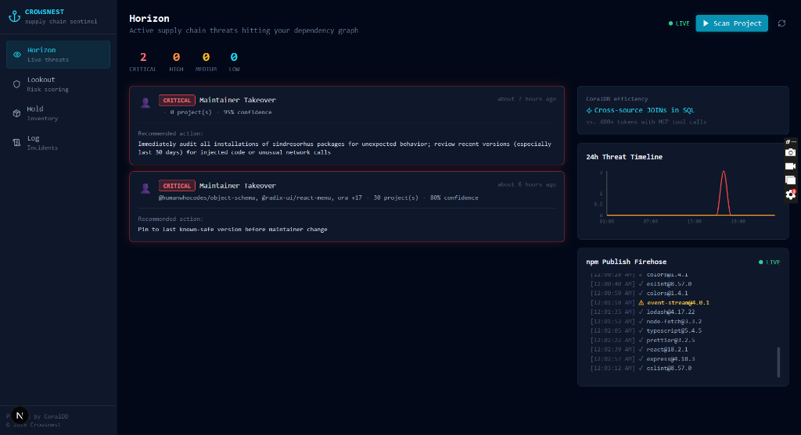
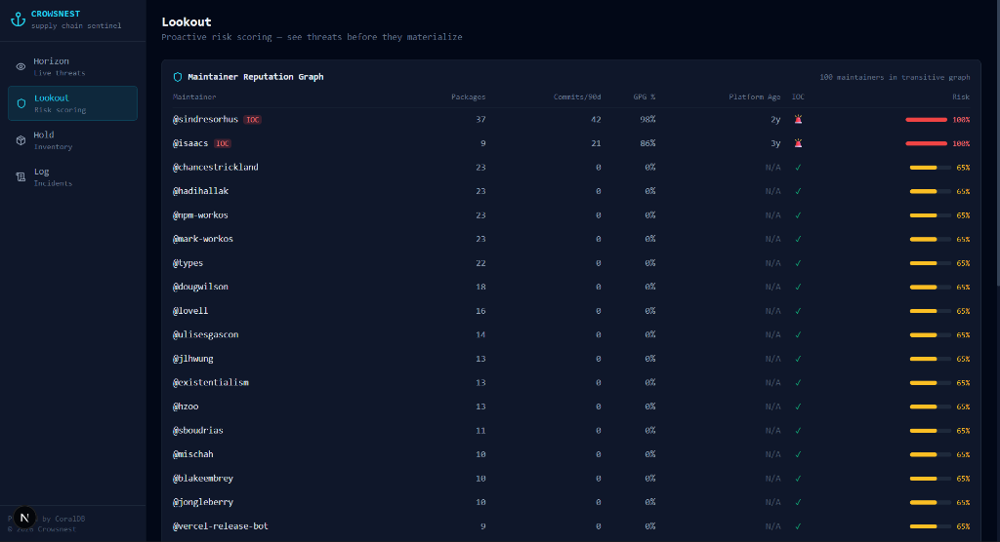
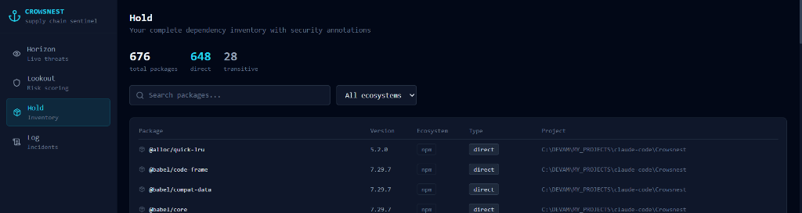
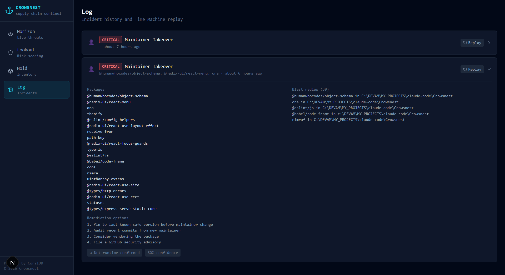

# Crowsnest

Catches supply chain attacks before they land in your lockfile. Runs SQL across npm, GitHub, threat intel, and your local dependency graph using Coral, so the checks that normally take 200 API calls and a million tokens of agent context happen in one query.

Built for the WeMakeDevs × Coral hackathon. Would have been built for the next CVE trending on Hacker News too, except those drop faster than we ship.

---

## Why this exists

The last twelve months on npm and PyPI have been rough:

- The Shai-Hulud worm (Sept 2025) and its descendants (April, May 2026) stole publish tokens and used them to republish packages with self-propagating malware. On May 19, TeamPCP pushed 323 malicious packages in 22 minutes. The "Mini" prefix on Mini Shai-Hulud is doing a lot of work.
- The May 11 TanStack attack was the first malicious npm package with a valid SLSA provenance attestation. The cryptographic gold standard signed off on a backdoor. We now live in the timeline where attestation is a feature attackers also enjoy.
- A hallucinated npm package called `react-codeshift` spread to 237 repos in January 2026. Nobody deliberately planted it. AI agents kept trying to install it because an LLM said it existed. The future is exquisitely stupid.

Catching any of these requires correlating four things at once: your lockfile, registry maintainer history, commit telemetry, and threat intel. Snyk does CVEs. Socket reads package code. Dependabot opens PRs nobody merges. None of them JOIN across these sources. That's where Crowsnest sits.

---

## How it works

```
                  ┌────────────────────────┐
                  │   VS Code Extension    │
                  └──────────┬─────────────┘
                             │ HTTP
                             ▼
 ┌───────────┐ HTTP ┌──────────────────────┐  SSE  ┌──────────────┐
 │ Dashboard │◄────►│  FastAPI Core        │──────►│  Slack Bot   │
 │ (Next.js) │      │  (Python)            │       │  (Bolt)      │
 └───────────┘      └──────────┬───────────┘       └──────────────┘
                               │
                               ▼
                    ┌─────────────────────┐
                    │    CoralEngine      │
                    │  (crowsnest.duckdb) │
                    └─────────────────────┘
                               ▲
         ┌─────────────────────┼─────────────────────┐
         │                     │                     │
 ┌───────┴──────┐      ┌───────┴──────┐      ┌───────┴──────┐
 │  Lockfiles   │      │  Registries  │      │ Git + Intel  │
 │              │      │ (npm / PyPI) │      │ (GH/Socket)  │
 └──────────────┘      └──────────────┘      └──────────────┘
```

The pieces:

- **FastAPI core (Python).** Parses lockfiles, runs the LangGraph agent pipeline, exposes the API every other surface talks to.
- **CoralEngine.** A DuckDB-backed federation layer. Every external source becomes a SQL table; the agents write SQL; the LLM only sees filtered rows.
- **Next.js dashboard.** Four tabs that do roughly what their names suggest.

### Dashboard tour

#### Horizon — live threat feed


The main view. Active incidents with severity, summary stats up top, and an npm publish firehose streaming on the right so you can watch the registry breathe in real time. Click any incident card to expand its forensics trail. Stare at the firehose for ten minutes and you'll see at least one package named like `test-test-FINAL-v2-real-this-time` — a useful reminder that the registry is a public restroom.

#### Lookout — maintainer reputation


A risk score for every maintainer in your transitive graph. Sorts by danger. Factors in platform age, GPG signing ratio, recent commit volume, 2FA status, and active IOC hits. The point of this tab is finding the dormant maintainer whose package you forgot you depend on — which is, conveniently, the exact target profile of an XZ-style takeover.

#### Hold — dependency inventory


Your full transitive graph parsed out of every lockfile in the project. Direct vs transitive, version, ecosystem, which file pulled it in. The view you wished you had at 2am during the last CVE fire drill, when you were grepping `package-lock.json` files across nine repos with your soul leaving your body.

#### Log — incident history and Time Machine


Past incidents with their forensics, affected packages, and recommended remediation. Each card has a Replay button that re-runs the detection against an older DuckDB snapshot. So when someone in `#security` asks "were we exposed during the May 11 window," you can answer with a SQL query instead of a four-hour forensics expedition.

- **VS Code extension (TypeScript).** Inline gutter warnings on `import` and `require` lines. Hover for the reasoning.
- **Slack bot (Bolt).** Posts incident cards to your security channel. Supports `/crowsnest-scan`, `/crowsnest-investigate`, `/crowsnest-blast-radius`.

---

## How we used Coral

Without Coral, the same pipeline is 800 lines of API glue, three retry-with-exponential-backoff helpers, a Redis cache nobody asked for, and a Claude bill that finance starts asking pointed questions about.

With Coral: every source is a SQL table inside DuckDB. GitHub commits, npm metadata, lockfile contents, Socket behavioral flags, the Shai-Hulud IOC feed we seeded by hand. The agents write a query. Coral resolves the data. The LLM reads the rows that matter and ignores the four million it doesn't.

### The query that catches an XZ-style takeover

This is the one to read. Four tables joined with a cadence subquery, ~100ms in DuckDB. Would have flagged the XZ Utils backdoor before it shipped in distro repos. Sorry, "Jia Tan."

```sql
-- Find deps where a new maintainer is making structural changes
-- right as the legacy maintainer's commit activity collapses.
SELECT
  l.package,
  l.version,
  l.ecosystem,
  m_old.maintainer_login AS legacy_maintainer,
  m_new.maintainer_login AS new_maintainer,
  m_new.ts              AS new_maintainer_added,
  c.files_changed,
  c.ts                  AS suspicious_commit_ts
FROM local_lockfiles l
JOIN npm_maintainers m_new
  ON m_new.package = l.package
  AND m_new.action = 'add'
  AND m_new.ts > CURRENT_TIMESTAMP - INTERVAL '180 days'
JOIN npm_maintainers m_old
  ON m_old.package = l.package
  AND m_old.action = 'add'
  AND m_old.ts < CURRENT_TIMESTAMP - INTERVAL '730 days'
  AND m_old.maintainer_login != m_new.maintainer_login
JOIN gh_commits c
  ON c.repo = (SELECT repo_url FROM npm_packages WHERE name = l.package LIMIT 1)
  AND c.author_login = m_new.maintainer_login
  AND c.ts > m_new.ts
WHERE
  -- Legacy maintainer's recent commits are under 20% of their historical baseline.
  -- (Burnt out, ghosted, or quietly handing over the keys.)
  (
    SELECT COUNT(*) FROM gh_commits gc1
    WHERE gc1.author_login = m_old.maintainer_login
      AND gc1.ts > CURRENT_TIMESTAMP - INTERVAL '90 days'
  ) < 0.2 * (
    SELECT COUNT(*) FROM gh_commits gc2
    WHERE gc2.author_login = m_old.maintainer_login
      AND gc2.ts BETWEEN CURRENT_TIMESTAMP - INTERVAL '730 days'
                     AND CURRENT_TIMESTAMP - INTERVAL '90 days'
  ) / 8.0
  -- And the new person is touching the files attackers actually care about.
  AND (
    list_contains(c.files_changed, '.github/workflows')
    OR list_contains(c.files_changed, 'configure')
    OR list_contains(c.files_changed, 'package.json')
    OR list_contains(c.files_changed, 'CMakeLists.txt')
    OR list_contains(c.files_changed, 'Makefile')
  )
ORDER BY m_new.ts DESC
LIMIT 50;
```

Existing scanners don't catch this because they don't JOIN across registries, maintainer history, and commits. Crowsnest does. That's the whole product, really.

---

## Data sources

Four feeds, all federated through Coral.

- **Lockfiles.** `package-lock.json`, `pnpm-lock.yaml`, `poetry.lock`. Direct and transitive deps, parsed into rows.
- **GitHub.** Commits, GPG signature verification, workflow files, OIDC tokens, contributor history.
- **Registries.** npm and PyPI: versions, downloads, publish events, maintainer change logs.
- **Threat intel.** Socket.dev behavioral flags (`shellEscape`, `envVarExfil`, the usual horror lineup) plus a curated IOC table for Shai-Hulud, Mini Shai-Hulud, and TeamPCP campaigns.

---

## Setup

Requirements: Python 3.12+, Node 18+, pnpm or npm.

### 1. Environment

```bash
cp .env.example .env
```

```env
ANTHROPIC_API_KEY=your_key_here

GITHUB_TOKEN=your_token_here
GITHUB_ORG=your_org_here

SOCKET_API_KEY=your_key_here

# Slack (optional)
SLACK_BOT_TOKEN=xoxb-...
SLACK_APP_TOKEN=xapp-...
SLACK_SIGNING_SECRET=...
CROWSNEST_ALERT_CHANNEL=#security
CROWSNEST_API_URL=http://localhost:8000
```

### 2. Backend

```bash
python -m venv .venv-claude
source .venv-claude/bin/activate         # Windows: .venv-claude\Scripts\activate

pip install -e .

uvicorn packages.core.api:app --host 0.0.0.0 --port 8000 --reload
```

You want `[info] seed.complete` followed by uvicorn bound to `:8000`. If you don't see it: your Python's too old, the venv didn't activate, or something is squatting port 8000 (usually a previous run of this exact thing, refusing to die).

### 3. Dashboard

```bash
cd packages/dashboard
npm install
npm run dev
```

Open `http://localhost:3000`. The Live indicator should be green. If it isn't, the backend isn't up. If the backend *is* up and it's still not green, you have a CORS issue, and we extend our sincere condolences.

### 4. Slack bot

```bash
cd packages/slack-bot
npm install
npm run dev
```

### 5. VS Code extension

Open `packages/vscode-extension` in its own VS Code window, `npm install`, `npm run compile`, then F5. A second window opens labelled `[Extension Development Host]`. Inline warnings appear on JS/TS import lines.

---

## What it doesn't do

- Stop you from typing `--force` at 3am. It warns. The rest is on you.
- Catch zero-days with no public signal anywhere. If Socket hasn't seen it, OSV hasn't seen it, and nobody's posted about it yet, neither will we. We catch them on the next wave once they republish. There is always a next wave.
- Replace Snyk or Dependabot for CVE coverage. We handle the things they don't see, not the things they already handle competently.
- Convince your CTO to actually patch the deps Crowsnest flags. That part is a people problem and out of scope.

---
