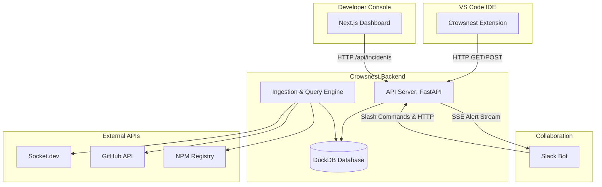

cd /d c:\DEVAM\MY_PROJECTS\claude-code\Crowsnest && .venv-claude\Scripts\activate && uvicorn packages.core.api:app --host 0.0.0.0 --port 8000 2>&1
REM macOS/Linux: cd /path/to/Crowsnest && source .venv-claude/bin/activate && uvicorn packages.core.api:app --host 0.0.0.0 --port 8000 2>&1


An absolute walkthrough of **Crowsnest**, the supply-chain risk analysis framework, is detailed below. 

Crowsnest is a sentinel system designed to spot malicious software supply-chain behavior (like dependency confusion, typosquatting/slopsquatting, maintainer takeovers, and token-theft worms) before or during their integration into your systems.

---

# Crowsnest Project Walkthrough

## 1. What is Crowsnest?
Crowsnest is a multi-tier security sentinel that monitors dependency graphs and package behaviors to detect open-source supply-chain risks. It acts as an early warning system (like a look-out in the "crow's nest" of a ship) to alert developers of compromised, suspicious, or AI-hallucinated packages.

It comprises:
1. **Core Analysis Engine (Python)**: Parses lockfiles, hooks into external APIs (like Socket.dev, GitHub), runs graph analytics, and uses DuckDB as an in-memory/on-disk fast query store to detect complex multi-package attacks.
2. **Dashboard UI (Next.js)**: A premium Dark Mode interface to view current alerts, inspect package blast radiuses, look at scan logs, and replay/triage security events.
3. **VS Code Extension (TypeScript)**: Alerts developers *inline* inside their IDE as they write `import` or `require` statements.
4. **Slack Bot (Bolt TS)**: Streams real-time alerts for CRITICAL/HIGH incidents and supports on-demand scans and blast radius lookup commands directly from Slack.

---

## 2. Why Crowsnest? (The Threat Landscape)
Modern developers copy-paste or let AI generate import lines. This opens several vulnerability vectors:
* **Slopsquatting (AI Hallucinations)**: LLMs like ChatGPT or Copilot frequently hallucinate non-existent package names. Attackers register these hallucinated names on npm/PyPI containing malicious payloads. Crowsnest tracks AI-authored patterns and flags unregistered or highly suspicious packages.
* **Token-Theft Worms**: A package gets published and immediately publishes 10+ sub-packages within 30 minutes, each pointing to another to steal environmental keys or token structures. Crowsnest runs queries to detect these burst-publish behaviors.
* **Maintainer Takeovers**: An abandoned package gets transferred to a new, unverified account which immediately pushes a major version containing security bypasses.
* **SLSA Attestation Failures**: Ensuring that artifacts match verified CI build paths.

---

## 3. Architecture & Components



---

## 4. Feature Breakdown: What, Why, & How

### A. Graph Ingestion & Queries
* **What**: Ingests package lockfiles (`package-lock.json`, `pnpm-lock.yaml`, `poetry.lock`) into a unified DuckDB database.
* **Why**: To run analytical queries looking for structural issues. For example, detecting "publish bursts" (Token-Theft Worms) where an author publishes multiple packages in minutes, or finding "slopsquatting" targets.
* **How**: The core ingestor parses lockfiles, inserts packages and their dependencies into the DuckDB instance, and executes query templates:
  - **`SHAI_HULUD` Worm Query**: Detects 10+ package publishes under 30 minutes by the same maintainer account.
  - **`SLOPSQUAT` Detection**: Cross-references packages against known high-risk signals and queries Socket.dev for package age/activity.

### B. Git Blame Integration & AI-Authored Heuristics
* **What**: Scans the git repository's commit history for files editing dependencies.
* **Why**: Malicious packages are often introduced by AI code assistants without developer review. If we see a suspicious import, we want to know: *Did a human write this line or did an LLM suggest it?*
* **How**: Uses `gitpython` to blame lines introducing imports, checks if the commit author is an AI bot, or if the commit message contains LLM-typical text patterns (e.g. `"Add support for..."` or `"Co-authored-by: Copilot"`). It adds a weight to the risk score calculation.

### C. Live SSE (Server-Sent Events) Stream
* **What**: A real-time events endpoint (`/api/events`) on the FastAPI server.
* **Why**: To feed live incident updates to downstream alert systems (like Slack or a SIEM) without making them poll.
* **How**: Clients open a persistent connection. The engine pushes JSON messages (`type: "incident_detected"`) when a scanner detects threats during background scans or lockfile changes.

### D. The VS Code Extension
* **What**: A TypeScript extension displaying inline indicators (gutter decorations) and hovers.
* **Why**: Shifts security left—warns developers *before* they commit code containing compromised or hallucinated imports.
* **How**: 
  - Scans active files on change (debounced) for `import`/`require` syntax.
  - Asks Crowsnest API `/api/veto` for risks.
  - If risk > threshold, highlights line (⛔ for Critical, ⚠️ for High, 🟡 for Medium) and renders hover markdown explaining *why* it's flagged.

### E. The Slack Bot
* **What**: An application running with `@slack/bolt` using Socket Mode.
* **Why**: Out-of-band alerts for security teams.
* **How**: 
  - Subscribes to the FastAPI SSE events endpoint. If a `CRITICAL` or `HIGH` risk is found, it posts a styled Slack Block Kit block to the security channel.
  - Handles commands: `/crowsnest-scan`, `/crowsnest-investigate <package>`, and `/crowsnest-blast-radius <maintainer>`.

---

## 5. Setting Up the Project

Follow these steps to run the complete environment locally:

### Step 1: Environment Variables
Create a `.env` file in the root directory. You can copy it from `.env.example`:
```bash
cp .env.example .env
```
Ensure you provide the following keys:
```env
# Core AI and Git access
ANTHROPIC_API_KEY=your_key       # For LLM analysis if used
GITHUB_TOKEN=your_github_token   # To retrieve repo metadata
GITHUB_ORG=your_org

# Threat Intelligence
SOCKET_API_KEY=your_socket_key   # Crucial for live threat feeds

# Slack Credentials
SLACK_BOT_TOKEN=xoxb-...         # Bot User OAuth Token
SLACK_APP_TOKEN=xapp-...         # Socket Mode App Token (Connections:Write)
SLACK_SIGNING_SECRET=...         # App signing secret
CROWSNEST_ALERT_CHANNEL=#security
CROWSNEST_API_URL=http://localhost:8000
```

### Step 2: Running the Python Backend (Core API)
Install dependencies and run the FastAPI server:
```bash

cd C:\DEVAM\MY_PROJECTS\claude-code\Crowsnest
# macOS/Linux: cd /path/to/Crowsnest

python -m venv .venv-claude
source .venv-claude/bin/activate       # Windows: .venv-claude\Scripts\activate

pip install -e .

# Start the FastAPI server (usually runs on port 8000)


uvicorn packages.core.api:app --host 0.0.0.0 --port 8000 --reload
```

### Step 3: Running the Dashboard (Frontend)
Run the Next.js frontend application:
```bash
# Navigate to the dashboard
cd packages/dashboard

# Install packages
npm install

# Start the development server (runs on port 3000)
npm run dev
```
Open `http://localhost:3000` to access the Crowsnest control center.

### Step 4: Running the Slack Bot
The Slack bot hooks into the backend SSE stream:
```bash
# Navigate to the Slack bot
cd packages/slack-bot

# Install packages
npm install

# Run the developer script (utilizes tsx to run typescript directly)
npm run dev
```

### Step 5: Testing the VS Code Extension
To run and test the inline IDE warnings:
```bash
# Navigate to the extension
cd packages/vscode-extension

# Install packages
npm install

# Compile the TypeScript files
npm run compile
```
* **To launch**: Open the `packages/vscode-extension` folder in VS Code, press `F5` to open an Extension Development Host window, and open any Javascript/Typescript file. Writing a mock compromised import will trigger a gutter icon.